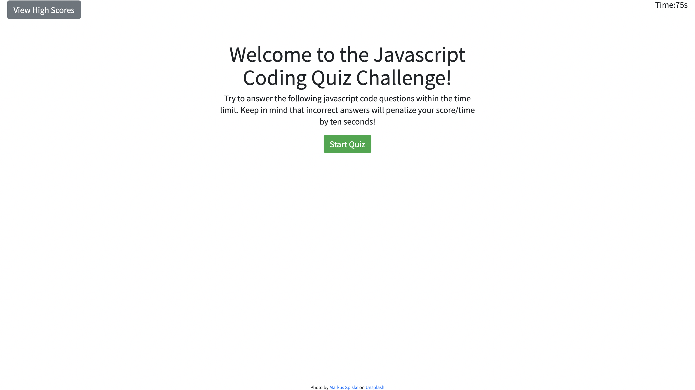

# code-quiz-with-JS
Deployed Application : (https://onaysa.github.io/code-quiz-with-JS/)

## Description
JavaScript is a powerful language that makes everything possible. The beauty of the syntax makes all kinds of learners and developers understand the language with ease and astounding pieces of technology are created.

This JavaScript Code Quiz challenge has 5 questions total and they’re all multiple choice. Upon completion, you will receive a score. By submitting your inital, your score will be added to a Highscore record. The Highscore board allows you to track your personal scores and display the top scores yo have.

- Why did you build this project? 
I built this project to help me  understad how to create an interactive website using JS , html and css.

## Usage

The following image shows the web application's appearance and functionality:

## License

License

---

